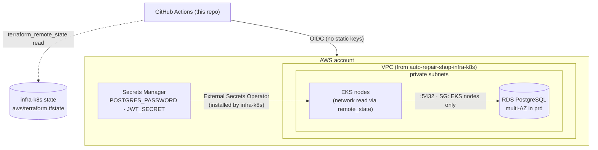

# auto-repair-shop-infra-db

Terraform for the managed database (AWS RDS PostgreSQL) used by the
[auto-repair-shop](https://github.com/POS-FIAP-15SOAT-TEAM-DARK-MODE/auto-repair-shop)
application. Split out of the app's monorepo as part of the Fase 3 (Tech
Challenge) requirement for 4 independent repositories with their own CI/CD.

This repository provisions **only** the database — it does not create or
duplicate any networking. It reads the VPC, private subnets and the EKS node
security group from the
[auto-repair-shop-infra-k8s](https://github.com/POS-FIAP-15SOAT-TEAM-DARK-MODE/auto-repair-shop-infra-k8s)
repo's `aws` state via `terraform_remote_state`, so the cluster must be
provisioned (or at least its `aws` layer applied) before this state can apply.

## Technologies

- Terraform (>= 1.10), AWS provider (~> 6.0), `terraform-aws-modules/rds/aws`
- AWS: RDS (PostgreSQL 15), Secrets Manager, Security Groups, CloudWatch (dashboard)
- GitHub Actions (OIDC — no long-lived AWS keys)

## Structure

```
terraform/
├── versions.tf        # backend (S3, key = db/terraform.tfstate — same bucket as infra-k8s)
├── variables.tf
├── locals.tf           # per-environment sizing (stg/prd), derived from the workspace
├── remote_state.tf      # reads VPC/subnets/node SG from auto-repair-shop-infra-k8s
├── rds.tf               # RDS instance, security group, Secrets Manager entry
├── dashboard.tf         # CloudWatch dashboard (CPU, memory, connections)
└── outputs.tf
```

The state bucket is the **same** S3 bucket created once by
`auto-repair-shop-infra-k8s`'s `bootstrap` state
(`auto-repair-shop-tfstate-<account_id>`), under a different key
(`db/terraform.tfstate`) so the two states never collide.

## Deploy — driven from GitHub Actions

No AWS tooling is needed on your machine; applied via GitHub Actions (OIDC).

**Prerequisites:**
1. `auto-repair-shop-infra-k8s`'s `bootstrap` + `shared` states already
   applied (state bucket + GitHub OIDC provider + `terraform` IAM role exist).
2. `auto-repair-shop-infra-k8s`'s `aws` state already applied for the target
   workspace (stg/prd) — this repo reads its VPC/subnet outputs.

**GitHub config** (Settings → Environments):
- `infra` → variable `AWS_TERRAFORM_ROLE_ARN` = the same `terraform_role_arn`
  output used by `auto-repair-shop-infra-k8s` (one IAM role, shared across the
  infra repos, scoped by GitHub OIDC `sub` claim to the `infra` environment —
  update the role's trust policy `github_repo`/`environments` if it needs to
  allow this repo explicitly).

**Provision the database** — run the **Infra (Terraform)** workflow
(`workflow_dispatch`) with `action=apply` for `stg` and `prd`. Copy the
printed `db_host` into the `auto-repair-shop` app repo's `RDS_HOST` GitHub
Environment variable (STG/PRD).

PRs touching `terraform/**` get an automatic `fmt` + `validate` (no
credentials required).

## Observability — CPU/memory metrics & dashboard

RDS already publishes its own infra metrics to CloudWatch, no agent to
install. `terraform/dashboard.tf` provisions a CloudWatch dashboard
(`<project>-<env>-rds`) with CPU utilization, freeable memory and connection
count. After apply, get the console link from the `cloudwatch_dashboard_url`
output:
```bash
terraform -chdir=terraform output -raw cloudwatch_dashboard_url
```

Cluster/pod-level CPU (EKS nodes) is covered separately by
`auto-repair-shop-infra-k8s`'s kube-prometheus-stack (Prometheus + Grafana).

## Local development

Not applicable — no local/Docker path. For ad hoc `terraform plan` against a
real AWS account, install `terraform` and the `aws` CLI locally.

## Swagger / Postman

Not applicable — this repository provisions infrastructure only, no HTTP API
of its own.

## Architecture



## Related repositories

- [auto-repair-shop](https://github.com/POS-FIAP-15SOAT-TEAM-DARK-MODE/auto-repair-shop) — the application that connects to this database
- [auto-repair-shop-infra-k8s](https://github.com/POS-FIAP-15SOAT-TEAM-DARK-MODE/auto-repair-shop-infra-k8s) — the cluster + VPC this database is placed into
