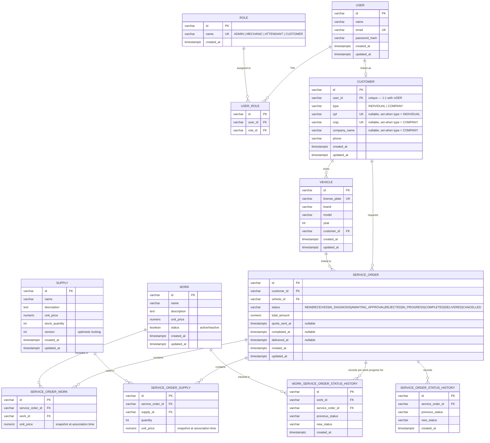

# Database choice and entity-relationship model

## Why PostgreSQL

1. **ACID with strong isolation via MVCC** — service orders, stock and roles get updated by multiple actors (attendant, mechanic, customer) concurrently; PostgreSQL's MVCC gives each transaction a consistent snapshot without the heavier locking a weaker isolation model would need.
2. **Rich indexing** — partial, GIN, GiST and expression indexes fit the actual query shapes here: exact-match lookups on `customer.cpf`/`customer.cnpj`, `vehicle.license_plate`, and `service_order.status`.
3. **Concurrent-write performance** — service order status transitions and `supply.stock_quantity` decrements happen frequently and concurrently; PostgreSQL's MVCC avoids the write contention a simpler locking model would hit under that pattern.
4. **Analytical queries built in** — window functions and CTEs support the average-execution-time reporting (`GET /v1/reports/average-execution-time`) directly in SQL, no separate analytics store needed.
5. **Data integrity at the schema level** — `CHECK` constraints (e.g. the `customer` type/document consistency check) and foreign keys enforce business rules the application would otherwise have to re-validate itself.
6. **Managed-service maturity** — RDS PostgreSQL gives multi-AZ failover, automated backups and point-in-time recovery with no operational overhead beyond what's already configured in `terraform/rds.tf`.

## Entity-relationship diagram

Generated from the live schema in `auto-repair-shop`'s
[`migrations/000001_init_schema.up.sql`](https://github.com/POS-FIAP-15SOAT-TEAM-DARK-MODE/auto-repair-shop/blob/develop/migrations/000001_init_schema.up.sql)
— table names, columns and cardinalities below match what's actually
deployed, not an earlier design draft.

## Relationship notes

- **`USER` ↔ `CUSTOMER` is 1:1, not 1:1-optional-both-ways.** Every `CUSTOMER` requires a `USER` (`user_id NOT NULL UNIQUE`), but not every `USER` is a customer — staff accounts (`ADMIN`, `MECHANIC`, `ATTENDANT`) are `USER` rows with no matching `CUSTOMER` row. This is also how the `lambda-auth` customer-login function resolves a CPF: `customer.cpf` → `customer.user_id` → roles via `USER_ROLE`.
- **`USER` ↔ `ROLE` is many-to-many** through `USER_ROLE`, so a single user can hold multiple roles simultaneously (e.g. an `ADMIN` who is also an `ATTENDANT`).
- **`WORK` vs. `SUPPLY`** are deliberately separate entities rather than a single "line item" table: `WORK` is a billable service with no stock concept; `SUPPLY` carries `stock_quantity` and an optimistic-locking `version` column, since parts get decremented under concurrent service orders and need conflict detection that a labor line item never does.
- **Two status-history tables, not one.** `SERVICE_ORDER_STATUS_HISTORY` tracks the order's own status transitions; `WORK_SERVICE_ORDER_STATUS_HISTORY` separately tracks each individual work item's progress *within* a service order (e.g. one work item can be `IN_PROGRESS` while another on the same order is already `COMPLETED`). Collapsing these into one table would conflate order-level and work-level state machines that advance independently.
- **`SERVICE_ORDER_WORK` and `SERVICE_ORDER_SUPPLY` both snapshot `unit_price`** at the time the work/supply is added to the order, rather than joining live to `WORK.unit_price`/`SUPPLY.unit_price`. A later price change on the catalog item must not retroactively alter the total on an already-quoted or already-approved order.
- **Cascading deletes are deliberate, not incidental.** `ON DELETE CASCADE` runs from `USER` down through `CUSTOMER`, `VEHICLE` and `USER_ROLE`, and from `SERVICE_ORDER` down through its line items and status history — removing a customer's user account or a service order is expected to take its dependent rows with it, rather than leaving orphaned records.
